# Design Document: Daily Money Tracker

## Overview

Daily Money Tracker is a mobile-first Progressive Web Application (PWA) that helps users build a daily financial logging habit. The system consists of a React-based PWA frontend, a Python FastAPI backend, and a MySQL database accessed via SQLAlchemy. An external LLM API powers the AI assistant features (budget recommendations, proactive coaching, conversational data queries).

The architecture prioritizes:
- **Speed of logging**: Sub-30-second transaction entry via Quick_Add
- **Offline resilience**: Service worker caching for core UI and queued transaction writes
- **Habit formation**: Daily task generation, streak tracking, and push notifications
- **Locale awareness**: Country-driven currency/date formatting that flows from configuration through every display layer

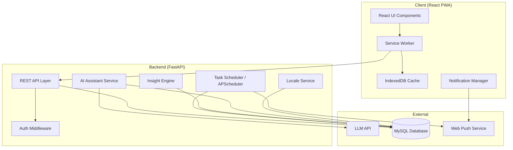

## Architecture

### System Layers

1. **Presentation Layer (React PWA)**
   - Single-page application with React + TypeScript
   - Service worker for offline caching, background sync, and push notification handling
   - IndexedDB for offline transaction queue and UI state caching
   - Responsive mobile-first layout (designed for 360px+ viewports)

2. **API Layer (FastAPI)**
   - RESTful endpoints with JSON request/response
   - Input validation via Pydantic models
   - Rate limiting on AI endpoints (to control LLM costs)
   - CORS configured for the PWA origin

3. **Business Logic Layer**
   - **Insight Engine**: Runs spending summaries, spike detection, budget projections
   - **AI Assistant Service**: Orchestrates LLM calls with user data context
   - **Locale Service**: Resolves country → currency/date/week settings
   - **Task Scheduler**: APScheduler for daily task generation, summary generation, spike checks

4. **Data Layer (MySQL + SQLAlchemy)**
   - SQLAlchemy ORM models with declarative mapping
   - Monetary amounts stored as integers in smallest currency unit
   - All timestamps stored in UTC
   - Alembic for database migrations

### Key Design Decisions

| Decision | Rationale |
|----------|-----------|
| Store amounts as integers (smallest unit) | Eliminates floating-point precision errors per Requirement 13.6 |
| Store currency code with each transaction | Supports country changes without corrupting historical data (Req 14.8) |
| APScheduler for periodic jobs | Lightweight, in-process scheduling for daily tasks and summaries without external infra |
| IndexedDB for offline queue | PWA can log transactions offline; syncs when connectivity returns |
| Single LLM prompt per query with user data context | Keeps AI responses grounded in actual user data, limits token usage |

## Components and Interfaces

### Frontend Components

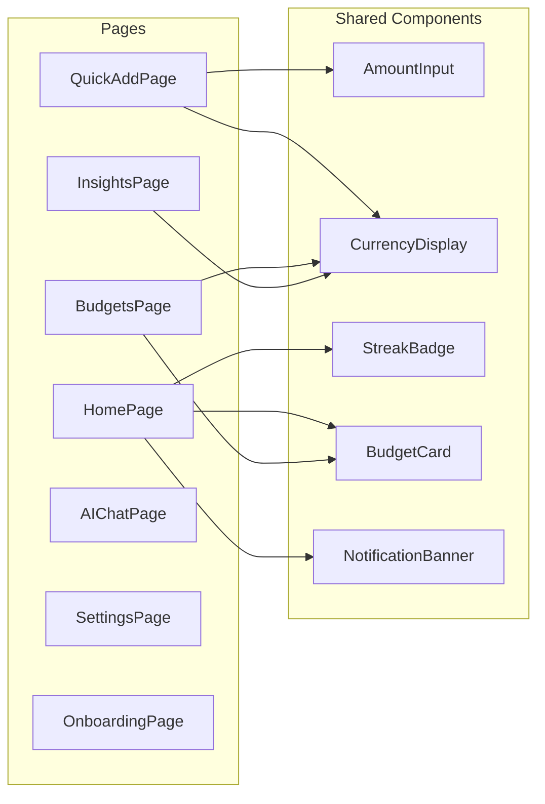

#### AmountInput Component
- Renders currency symbol prefix/suffix based on locale
- Enforces decimal precision (0, 2, or 3 decimal places per currency)
- Validates positive numeric input in real-time
- Formats display with locale-appropriate separators

#### CurrencyDisplay Component
- Formats integer amounts into locale-appropriate display strings
- Parameters: `amount` (integer, smallest unit), `currencyCode` (ISO 4217)
- Uses locale config to determine symbol, separators, precision

### Backend Services

#### TransactionService
```
create_transaction(amount_smallest_unit: int, direction: str, currency_code: str, ...) → Transaction
get_transactions(date_range, category?, limit?) → List[Transaction]
get_frequent_categories(days: int = 30, limit: int = 5) → List[str]
suggest_category(note: str?, amount: int?) → Optional[str]
```

#### DailyTaskService
```
generate_daily_task(user_id: int, date: date) → DailyTask
complete_task(task_id: int, completion_type: str) → DailyTask
get_current_task(user_id: int) → Optional[DailyTask]
check_grace_period(user_id: int) → GracePeriodStatus
```

#### StreakService
```
get_current_streak(user_id: int) → int
increment_streak(user_id: int) → int
reset_streak(user_id: int) → int  # returns 0
evaluate_missed_days(user_id: int) → StreakEvaluation
```

#### InsightEngine
```
generate_weekly_summary(user_id: int, week_end_date: date) → WeeklySummary
generate_monthly_summary(user_id: int, month: int, year: int) → MonthlySummary
detect_spending_spikes(user_id: int) → List[SpendingSpike]
calculate_budget_projection(budget_id: int) → BudgetProjection
```

#### AIAssistantService
```
get_budget_recommendation(user_id: int) → AIResponse
get_proactive_coaching(user_id: int) → List[AIResponse]
answer_query(user_id: int, question: str) → AIResponse
```

#### LocaleService
```
get_locale_config(country_code: str) → LocaleConfig
format_amount(amount_smallest_unit: int, locale: LocaleConfig) → str
parse_amount_input(input_str: str, locale: LocaleConfig) → int  # returns smallest unit
get_week_boundaries(date: date, locale: LocaleConfig) → Tuple[date, date]
```

### API Endpoints

| Method | Path | Description |
|--------|------|-------------|
| POST | `/api/transactions` | Create a transaction |
| GET | `/api/transactions` | List transactions (with filters) |
| GET | `/api/transactions/frequent-categories` | Get top categories from last 30 days |
| POST | `/api/transactions/suggest-category` | Get category suggestion for note/amount |
| GET | `/api/daily-task` | Get current daily task status |
| POST | `/api/daily-task/complete` | Mark task as "no transactions" |
| GET | `/api/streak` | Get current streak info |
| GET | `/api/budgets` | List active budgets with status |
| POST | `/api/budgets` | Create a budget |
| PUT | `/api/budgets/{id}` | Update budget limit |
| DELETE | `/api/budgets/{id}` | Deactivate a budget |
| GET | `/api/insights/weekly` | Get weekly summary |
| GET | `/api/insights/monthly` | Get monthly summary |
| GET | `/api/insights/spikes` | Get active spending spike alerts |
| POST | `/api/ai/recommend-budget` | Request AI budget recommendation |
| POST | `/api/ai/query` | Send natural language data query |
| GET | `/api/ai/coaching` | Get pending proactive suggestions |
| POST | `/api/ai/coaching/{id}/dismiss` | Dismiss a coaching suggestion |
| GET | `/api/settings/locale` | Get current locale config |
| PUT | `/api/settings/locale` | Update country/locale |
| GET | `/api/notifications` | Get unread in-app notifications |
| PUT | `/api/notifications/{id}/read` | Mark notification as read |
| POST | `/api/notifications/push-subscription` | Register push subscription |

## Data Models

### SQLAlchemy Models

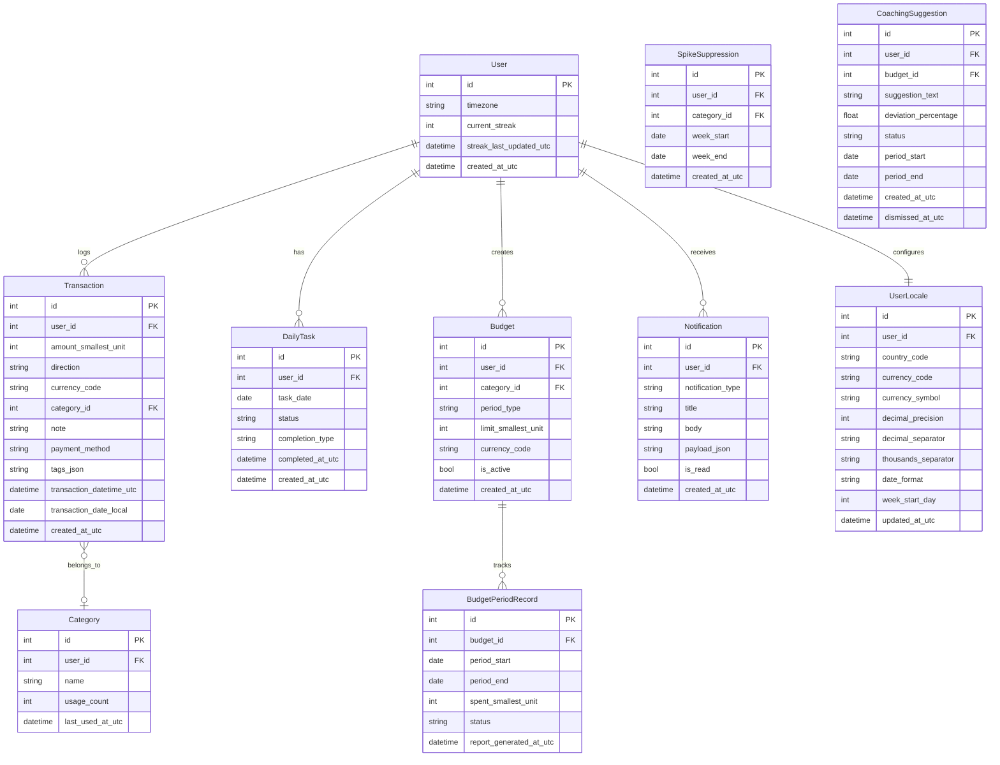

### Key Model Details

**Transaction.amount_smallest_unit**: Integer storing amount in smallest currency unit (e.g., 1050 = $10.50 for USD, 1050 = ¥1050 for JPY). The `currency_code` field enables correct reconversion for display.

**DailyTask.status**: Enum of `pending`, `completed`, `missed`, `grace_period`.

**DailyTask.completion_type**: Enum of `transaction_logged`, `no_transactions`, `grace_recovery`.

**Budget.period_type**: Enum of `weekly`, `monthly`.

**Budget.category_id**: NULL means "overall" budget (all spending).

**SpikeSuppression**: Tracks which category/week combinations have already triggered an alert, enforcing the one-alert-per-category-per-week rule.

**CoachingSuggestion.status**: Enum of `pending`, `accepted`, `dismissed`. When dismissed, re-surfacing only happens if deviation increases by 10+ percentage points.

### Locale Configuration Data

A static configuration mapping (stored in code or seeded to DB) that maps country codes to locale settings:

```python
LOCALE_CONFIGS = {
    "US": LocaleConfig(
        currency_code="USD", symbol="$", decimal_precision=2,
        decimal_separator=".", thousands_separator=",",
        date_format="MM/DD/YYYY", week_start_day=0  # Sunday
    ),
    "GB": LocaleConfig(
        currency_code="GBP", symbol="£", decimal_precision=2,
        decimal_separator=".", thousands_separator=",",
        date_format="DD/MM/YYYY", week_start_day=1  # Monday
    ),
    "JP": LocaleConfig(
        currency_code="JPY", symbol="¥", decimal_precision=0,
        decimal_separator="", thousands_separator=",",
        date_format="YYYY/MM/DD", week_start_day=1  # Monday
    ),
    "IN": LocaleConfig(
        currency_code="INR", symbol="₹", decimal_precision=2,
        decimal_separator=".", thousands_separator=",",
        date_format="DD/MM/YYYY", week_start_day=1  # Monday
    ),
    # ... more countries
}
```


## Components and Interfaces — Requirements 15–18 Additions

### New Frontend Components

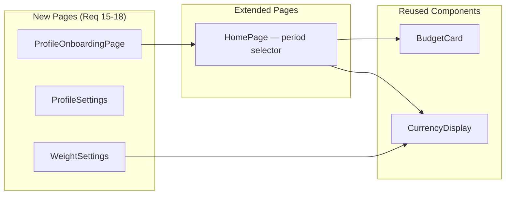

#### ProfileOnboardingPage
- Displayed after locale onboarding completes (gates main dashboard access)
- Form fields: employment_status (student | working | both), commute_method (public_transit | own_vehicle | walking_biking | none_remote)
- Conditional field: vehicle_type (motorcycle | car) shown only when commute_method = own_vehicle
- On submit: stores profile on User record, triggers CategoryWeightService recomputation

#### ProfileSettings
- Accessible from SettingsPage
- Displays current Lifestyle_Profile values
- Allows editing any field, with the same conditional vehicle_type logic
- On save: updates User record and triggers weight recomputation

#### WeightSettings
- Accessible from SettingsPage
- Displays all CategoryWeight entries with current percentages
- Allows manual override of individual weights
- Shows redistribution preview before confirmation
- Flags manually-overridden entries visually

#### Extended HomePage (Period Selector)
- Adds a period selector dropdown at the top: Daily | Weekly | Monthly
- Below the selector: current balance, total income, total expenses for the selected period
- Per-category budget list using existing BudgetCard component
- One personalization-aware insight banner driven by Lifestyle_Profile
- Reuses InsightEngine aggregation methods — no parallel logic

### New Backend Services

#### ProfileService
```
get_profile(user_id: int) → LifestyleProfile
update_profile(user_id: int, profile: LifestyleProfileInput) → LifestyleProfile
```
- Reads/writes employment_status, commute_method, vehicle_type on the User model
- On update, calls `CategoryWeightService.recompute_weights(user_id)`

#### CategoryWeightService
```
get_weights(user_id: int) → List[CategoryWeight]
recompute_weights(user_id: int) → List[CategoryWeight]
override_weight(user_id: int, category_name: str, new_percentage: Decimal) → List[CategoryWeight]
validate_weights(weights: List[CategoryWeight]) → bool  # sum == 100%
derive_defaults(profile: LifestyleProfile) → List[CategoryWeight]
```
- `recompute_weights`: Reads user profile, looks up Weight_Rules_Table, replaces non-manually-overridden weights with new defaults, redistributes to maintain 100% sum
- `override_weight`: Sets the specified category to the new percentage, redistributes remaining non-overridden categories proportionally, marks the overridden category with `is_manual_override = True`
- `derive_defaults`: Pure function mapping profile answers → default percentages via the Weight_Rules_Table
- `validate_weights`: Asserts all entries sum to exactly 100% (integer basis points or Decimal to avoid float issues)

#### Extended BudgetService (Dynamic Recalculation)
```
recalculate_on_income(user_id: int, income_transaction: Transaction) → List[BudgetLimitChange]
```
- Called when a transaction with direction=received is logged
- For each active budget: new_limit = category_weight_percentage × available_balance
- Creates BudgetLimitChangeLog entries with reason and source_transaction_id
- Does NOT modify stored weight percentages
- Existing projection/on-track logic (Property 10) continues to work unchanged with the new dynamic limit

#### Extended InsightEngine (Period-Scoped Queries)
```
get_period_summary(user_id: int, period_type: str, reference_date: date) → PeriodSummary
get_personalized_insight(user_id: int, profile: LifestyleProfile, weights: List[CategoryWeight]) → str
```
- `get_period_summary`: Delegates to existing `generate_weekly_summary` / `generate_monthly_summary` for weekly/monthly; adds a new daily aggregation path for the "Daily" period
- `get_personalized_insight`: Selects a contextual tip based on the user's highest-weight category and current spending patterns (e.g., savings tip if Savings weight is highest and savings goal not met)

### New API Endpoints

| Method | Path | Description |
|--------|------|-------------|
| GET | `/api/profile` | Get current lifestyle profile |
| PUT | `/api/profile` | Create or update lifestyle profile |
| GET | `/api/weights` | Get user's category weight entries |
| PUT | `/api/weights/{category_name}` | Manually override a single category weight |
| POST | `/api/weights/reset` | Reset weights to profile-derived defaults |
| GET | `/api/dashboard/summary?period={daily\|weekly\|monthly}` | Get period-scoped dashboard data |
| GET | `/api/dashboard/insight` | Get personalized insight for dashboard |

## Data Models — Requirements 15–18 Additions

### New and Extended Models

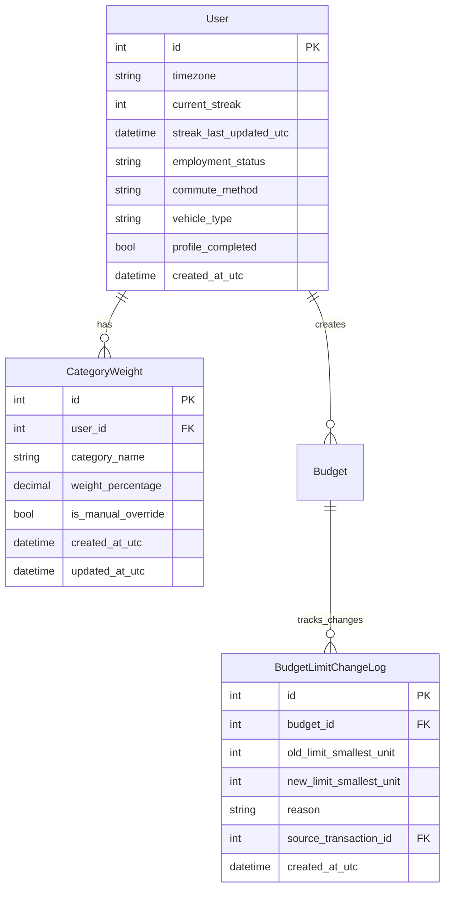

### Key Model Details (New)

**User.employment_status**: Enum of `student`, `working`, `both`. Nullable until profile onboarding completes.

**User.commute_method**: Enum of `public_transit`, `own_vehicle`, `walking_biking`, `none_remote`. Nullable until profile onboarding completes.

**User.vehicle_type**: Enum of `motorcycle`, `car`. Nullable; only populated when commute_method = own_vehicle.

**User.profile_completed**: Boolean flag. When False, the app gates access to the main dashboard after locale onboarding.

**CategoryWeight.category_name**: String matching a budget category name (e.g., "Savings", "Wants", "Transportation", "Food"). Unique per user.

**CategoryWeight.weight_percentage**: Decimal (precision 4, scale 2) representing the percentage (e.g., 25.00 for 25%). All entries for a user must sum to exactly 100.00.

**CategoryWeight.is_manual_override**: Boolean. True if the user explicitly set this weight; False if derived from the Weight_Rules_Table.

**BudgetLimitChangeLog.reason**: String describing why the limit changed (e.g., "Income received: 50000 from transaction #123").

**BudgetLimitChangeLog.source_transaction_id**: FK to the income Transaction that triggered the recalculation.

### Weight Rules Table Structure

The Weight_Rules_Table is a static lookup mapping profile answer combinations to default category weight distributions. The exact percentages are **pending user confirmation** — the structure below shows the lookup keys and category slots:

```python
# PLACEHOLDER — exact percentages to be confirmed by user
WEIGHT_RULES_TABLE: Dict[Tuple[str, str, Optional[str]], Dict[str, Decimal]] = {
    # Key: (employment_status, commute_method, vehicle_type)
    # Value: { category_name: weight_percentage }
    
    ("student", "public_transit", None): {
        "Savings": Decimal("___"),       # TBD
        "Wants": Decimal("___"),         # TBD
        "Transportation": Decimal("___"),# TBD
        "Food": Decimal("___"),          # TBD
    },
    ("student", "own_vehicle", "motorcycle"): {
        "Savings": Decimal("___"),
        "Wants": Decimal("___"),
        "Transportation": Decimal("___"),
        "Food": Decimal("___"),
    },
    ("student", "own_vehicle", "car"): {
        "Savings": Decimal("___"),
        "Wants": Decimal("___"),
        "Transportation": Decimal("___"),
        "Food": Decimal("___"),
    },
    ("student", "walking_biking", None): {
        "Savings": Decimal("___"),
        "Wants": Decimal("___"),
        "Transportation": Decimal("___"),
        "Food": Decimal("___"),
    },
    ("student", "none_remote", None): {
        "Savings": Decimal("___"),
        "Wants": Decimal("___"),
        "Transportation": Decimal("___"),
        "Food": Decimal("___"),
    },
    ("working", "public_transit", None): {
        "Savings": Decimal("___"),
        "Wants": Decimal("___"),
        "Transportation": Decimal("___"),
        "Food": Decimal("___"),
    },
    ("working", "own_vehicle", "motorcycle"): {
        "Savings": Decimal("___"),
        "Wants": Decimal("___"),
        "Transportation": Decimal("___"),
        "Food": Decimal("___"),
    },
    ("working", "own_vehicle", "car"): {
        "Savings": Decimal("___"),
        "Wants": Decimal("___"),
        "Transportation": Decimal("___"),
        "Food": Decimal("___"),
    },
    ("working", "walking_biking", None): {
        "Savings": Decimal("___"),
        "Wants": Decimal("___"),
        "Transportation": Decimal("___"),
        "Food": Decimal("___"),
    },
    ("working", "none_remote", None): {
        "Savings": Decimal("___"),
        "Wants": Decimal("___"),
        "Transportation": Decimal("___"),
        "Food": Decimal("___"),
    },
    ("both", "public_transit", None): {
        "Savings": Decimal("___"),
        "Wants": Decimal("___"),
        "Transportation": Decimal("___"),
        "Food": Decimal("___"),
    },
    ("both", "own_vehicle", "motorcycle"): {
        "Savings": Decimal("___"),
        "Wants": Decimal("___"),
        "Transportation": Decimal("___"),
        "Food": Decimal("___"),
    },
    ("both", "own_vehicle", "car"): {
        "Savings": Decimal("___"),
        "Wants": Decimal("___"),
        "Transportation": Decimal("___"),
        "Food": Decimal("___"),
    },
    ("both", "walking_biking", None): {
        "Savings": Decimal("___"),
        "Wants": Decimal("___"),
        "Transportation": Decimal("___"),
        "Food": Decimal("___"),
    },
    ("both", "none_remote", None): {
        "Savings": Decimal("___"),
        "Wants": Decimal("___"),
        "Transportation": Decimal("___"),
        "Food": Decimal("___"),
    },
}
```

> ⚠️ **ACTION REQUIRED**: The exact percentage values for each profile combination need to be confirmed. The structure and lookup keys are final; only the numeric values are placeholders.

## Correctness Properties

*A property is a characteristic or behavior that should hold true across all valid executions of a system — essentially, a formal statement about what the system should do. Properties serve as the bridge between human-readable specifications and machine-verifiable correctness guarantees.*

### Property 1: Amount formatting round-trip

*For any* valid monetary amount (integer in smallest currency unit) and any supported locale configuration, formatting the amount for display and then parsing the display string back to the smallest unit integer shall produce the original integer value.

**Validates: Requirements 5.8, 8.9, 13.6, 14.3**

### Property 2: Amount validation by locale

*For any* input string and locale configuration, the amount validator shall accept the input if and only if it represents a positive numeric value with decimal places not exceeding the currency's decimal precision, and shall reject all other inputs (non-numeric, zero, negative, excess decimals, exceeding currency maximum).

**Validates: Requirements 3.1, 3.6, 8.1, 8.8, 13.3, 14.4, 14.5**

### Property 3: Streak state machine correctness

*For any* sequence of daily task events (completed on time, completed during grace period, or grace period expired), the streak value shall equal the count of consecutive completed days ending at the current day, where grace period completions count as completed and any grace period expiration resets the count to zero.

**Validates: Requirements 1.6, 2.2, 2.3, 2.5**

### Property 4: Grace period remaining time calculation

*For any* timestamp within a grace period window (00:00:00 to 23:59:59 of the day following a missed day), the remaining time shall equal the difference between the grace period end (23:59:59) and the current timestamp, expressed in hours and minutes.

**Validates: Requirements 1.2, 2.4**

### Property 5: Daily task completion on transaction

*For any* valid transaction logged for the current day where the daily task is in a pending or grace_period state, saving the transaction shall transition the daily task status to completed.

**Validates: Requirements 1.5, 2.1**

### Property 6: Frequent categories top-N

*For any* set of transactions within the last 30 days, the frequent categories function shall return at most 5 categories sorted in descending order by usage count, where each returned category has a higher or equal usage count than any category not in the result set.

**Validates: Requirements 3.5**

### Property 7: Category suggestion pattern matching

*For any* transaction history with 5 or more categorized transactions and a new transaction with a note or amount, the category suggestion shall return the most frequently used category among transactions whose note exactly matches the new note or whose amount is within 10% of the new amount. If the user has previously overridden a suggestion for the same pattern, the overridden category shall be prioritized.

**Validates: Requirements 4.1, 4.3, 4.4**

### Property 8: Periodic summary aggregation

*For any* set of transactions within a calendar period (week or month), the spending summary shall report total_spent equal to the sum of all "spent" transactions, total_received equal to the sum of all "received" transactions, and per-category totals equal to the sum of transactions in each category. When a previous equivalent period exists, percentage change per category shall equal ((current - previous) / previous) * 100 rounded to one decimal place, or marked as "new" when previous is zero.

**Validates: Requirements 5.1, 5.2, 5.3, 5.4, 5.5, 5.7**

### Property 9: Spending spike detection

*For any* category with at least 4 weeks of transaction history, the spike detector shall flag the category if and only if the current week's spending exceeds 150% of the rolling 4-week average for that category. Furthermore, for any sequence of transactions within a single week, at most one spike alert shall be generated per category.

**Validates: Requirements 6.1, 6.2, 6.5**

### Property 10: Budget projection and on/off track status

*For any* active budget with days_elapsed > 0, the projected spend shall equal (total_spent / days_elapsed) * total_days_in_period. The budget shall be classified as "off track" if and only if projected_spend > budget_limit, with the overage equal to projected_spend - budget_limit. When days_elapsed is 0, the status shall be "on track" with remaining equal to the full budget limit.

**Validates: Requirements 7.1, 7.3, 7.4, 7.5**

### Property 11: Budget threshold notifications fire exactly once per crossing

*For any* sequence of transactions applied to a budget within a single budget period, the 80% threshold notification shall fire exactly once (when cumulative spend first reaches or exceeds 80% of the limit), and the 100% threshold notification shall fire exactly once (when cumulative spend first exceeds 100% of the limit), regardless of how many subsequent transactions occur.

**Validates: Requirements 8.3, 8.4**

### Property 12: Budget period rollover preserves limit

*For any* active budget whose budget period has ended, the system shall create exactly one new budget period with the same spending limit, and shall reject any attempt to create a duplicate budget for the same category/scope and period type while an active budget exists.

**Validates: Requirements 8.6, 8.7**

### Property 13: AI data eligibility filtering

*For any* user's transaction history, the AI recommendation service shall: return an "insufficient data" response if fewer than 14 days of history exist; and when 14+ days exist, include exactly those categories that have 3 or more transactions in the analyzed period.

**Validates: Requirements 9.3, 9.4**

### Property 14: Budget deviation detection and re-surfacing logic

*For any* budget at the midpoint of its period, the coaching system shall generate a suggestion if and only if |actual_spend - pro_rated_expected| / pro_rated_expected > 0.20. Once dismissed at deviation D%, the suggestion shall not re-surface unless the new deviation >= D + 10 percentage points. For any set of deviating budgets, each shall receive its own independent suggestion.

**Validates: Requirements 10.1, 10.4, 10.5**

### Property 15: Daily reminder at-most-once

*For any* day where the daily task is incomplete, the push notification reminder shall fire at most once, regardless of how many times the check runs or how long the task remains incomplete.

**Validates: Requirements 12.2**

### Property 16: Timestamp UTC round-trip

*For any* UTC timestamp and user timezone, converting from UTC to local time for display and then converting back to UTC shall produce the original UTC timestamp.

**Validates: Requirements 13.5**

### Property 17: Locale configuration completeness

*For any* supported country code, the locale resolution function shall return a complete configuration containing: a valid ISO 4217 currency code, a non-empty currency symbol, a decimal precision of 0, 2, or 3, defined separators, a valid date format pattern, and a week start day between 0 (Sunday) and 6 (Saturday).

**Validates: Requirements 14.2**

### Property 18: Date formatting by locale

*For any* date and locale configuration, the formatted date string shall match the pattern defined by the locale's date format (e.g., DD/MM/YYYY produces a string where day appears before month before year, each in the correct position).

**Validates: Requirements 14.6**

### Property 19: Week boundary calculation by locale

*For any* date and locale with a defined week start day, the computed week boundaries shall satisfy: start_of_week <= date <= end_of_week, end_of_week - start_of_week == 6 days, and start_of_week.weekday() == locale.week_start_day.

**Validates: Requirements 14.9**

### Property 20: Historical currency preservation on locale change

*For any* transaction created before a locale change, displaying that transaction after the locale change shall use the currency code stored with the transaction (not the new locale's currency), preserving the original formatting rules for that currency.

**Validates: Requirements 14.8**

### Property 21: Profile persistence and weight recomputation trigger

*For any* valid Lifestyle_Profile combination (employment_status ∈ {student, working, both}, commute_method ∈ {public_transit, own_vehicle, walking_biking, none_remote}, and vehicle_type ∈ {motorcycle, car, None}), submitting or updating the profile shall persist the exact values to the User record AND trigger a recomputation that produces a CategoryWeight set summing to exactly 100%.

**Validates: Requirements 15.4, 15.6**

### Property 22: Category weight sum invariant

*For any* sequence of operations on a user's CategoryWeight entries (initial derivation, profile change recomputation, or manual override), the sum of all weight_percentage values for that user shall always equal exactly 100% at every observable state.

**Validates: Requirements 16.1, 16.6**

### Property 23: Default weight derivation includes minimum categories

*For any* valid Lifestyle_Profile, deriving default weights from the Weight_Rules_Table shall produce a CategoryWeight set containing at minimum entries for "Savings", "Wants", "Transportation", and "Food", with each entry having a positive weight_percentage and all entries summing to 100%.

**Validates: Requirements 16.2, 16.3**

### Property 24: Manual weight override redistributes proportionally and flags correctly

*For any* set of CategoryWeight entries summing to 100% and any single category override to a new valid percentage (0 < new_pct < 100), the system shall redistribute the remaining non-overridden categories proportionally so the total remains 100%, mark the overridden category's is_manual_override flag as True, and leave non-overridden categories' flags unchanged.

**Validates: Requirements 16.5, 16.7**

### Property 25: Budget recalculation on income preserves weight percentages

*For any* income transaction (direction = received) and any set of active budgets with associated CategoryWeight entries, the budget recalculation shall update each budget's limit_smallest_unit to equal floor(weight_percentage / 100 × available_balance) while leaving all stored CategoryWeight percentage values unchanged.

**Validates: Requirements 17.1, 17.2**

### Property 26: Budget limit change audit logging

*For any* budget whose limit_smallest_unit changes due to an income-triggered recalculation, the system shall create exactly one BudgetLimitChangeLog entry with the correct old_limit, new_limit, a reason string containing the income amount, and the source_transaction_id matching the income transaction.

**Validates: Requirements 17.3**

### Property 27: Period-scoped dashboard aggregation

*For any* set of transactions and any period selection (daily, weekly, monthly), the dashboard summary shall report total_income equal to the sum of "received" transactions within the selected period boundaries, total_expenses equal to the sum of "spent" transactions within the same boundaries, and per-category budget progress consistent with the existing BudgetCard projection logic applied to the period-scoped data.

**Validates: Requirements 18.2**

## Error Handling

### Frontend Error Handling

| Scenario | Behavior |
|----------|----------|
| Network unavailable during transaction save | Queue transaction in IndexedDB; show "saved offline, will sync" indicator; sync via Background Sync API when connectivity returns |
| API returns validation error (4xx) | Display field-level error messages; retain all user input; highlight invalid fields |
| API returns server error (5xx) | Display generic "something went wrong" toast; offer retry button |
| Push notification permission denied | Fall back to in-app notifications only; show settings guidance message |
| Service worker registration fails | App continues without offline support; log error for diagnostics |
| IndexedDB unavailable | Degrade gracefully — require connectivity for all operations; display banner |

### Backend Error Handling

| Scenario | Behavior |
|----------|----------|
| Database write failure | Retry up to 3 times with exponential backoff (max 2s between attempts); return 503 with retry-after header if all fail |
| LLM API timeout (>15s for recommendations, >10s for queries) | Return timeout error response; log for monitoring; frontend shows "assistant unavailable" |
| LLM API rate limit exceeded | Queue request with backoff; return 429 to client with estimated wait time |
| Invalid transaction amount | Return 422 with specific validation error indicating constraints for the user's currency |
| Duplicate budget creation attempt | Return 409 Conflict with message identifying the existing active budget |
| Scheduler job failure | Log error; retry on next scheduler tick; alert monitoring if consecutive failures exceed threshold |
| Locale config not found for country | Return 400 with list of supported countries (should not happen with frontend validation) |
| Weight redistribution fails (no eligible categories) | Return 422 with message explaining that all other categories are manually overridden; suggest resetting weights first |
| Weight sum validation failure | Return 422 with message indicating weights do not sum to 100% — should never reach API if frontend validates correctly |
| Profile missing for weight derivation | Return 400 indicating profile must be completed before weights can be computed |
| Budget recalculation with zero available balance | Set all budget limits to 0; log the event; surface notification via existing budget threshold pattern |
| Weight_Rules_Table lookup miss (unknown profile combination) | Fall back to equal distribution across minimum categories; log warning for monitoring |

### Data Integrity Safeguards

- All database writes use transactions (SQLAlchemy sessions with commit/rollback)
- Monetary amounts validated against currency precision before persistence
- Streak modifications use optimistic locking (version column) to prevent race conditions
- Budget threshold notifications use idempotency keys (budget_id + period + threshold) to guarantee at-most-once delivery
- Spike suppression records prevent duplicate alerts within the same category+week
- CategoryWeight entries validated to sum to exactly 100% before any persist operation (Req 16.6)
- BudgetLimitChangeLog entries created atomically with budget limit updates (Req 17.3)
- Profile onboarding gate prevents dashboard access until profile_completed = True (Req 15.1)

## Testing Strategy

### Unit Tests (Example-Based)

Unit tests cover specific scenarios, edge cases, and integration points:

- **Transaction CRUD**: Create with all optional fields, create with minimum fields, validation rejection cases
- **Daily task state transitions**: pending → completed (via transaction), pending → completed (no transactions), pending → grace_period, grace_period → completed, grace_period → missed
- **Onboarding gate**: Block access without country selection, allow after selection
- **Budget creation**: Valid creation, duplicate rejection, invalid limit rejection
- **Notification preferences**: Default enabled, independent toggle, push permission denial fallback
- **AI unavailability**: LLM timeout handling, error message display
- **Database retry logic**: Successful retry on transient failure, exhausted retries behavior
- **Profile onboarding gate**: Block dashboard access until profile_completed = True; allow after submission (Req 15.1)
- **Conditional vehicle type prompt**: Show vehicle_type field only when commute_method = own_vehicle (Req 15.3)
- **Profile settings view/edit**: Display current profile, allow editing, trigger weight recomputation on save (Req 15.5)
- **Period selector UI**: Verify Daily/Weekly/Monthly options exist and switch dashboard data (Req 18.1)
- **Personalized insight display**: Verify insight banner appears with contextual tip (Req 18.4)
- **Weight override edge case**: Override to a value that leaves zero remaining for redistribution (Req 16.5 error case)

### Property-Based Tests

Property-based tests validate universal correctness properties with minimum 100 iterations each, using **Hypothesis** (Python) for backend logic and **fast-check** (TypeScript) for frontend logic.

Each property test is tagged with: `Feature: daily-money-tracker, Property {N}: {title}`

**Backend (Hypothesis):**
- Property 1: Amount formatting round-trip
- Property 2: Amount validation by locale
- Property 3: Streak state machine correctness
- Property 4: Grace period remaining time
- Property 6: Frequent categories top-N
- Property 7: Category suggestion pattern matching
- Property 8: Periodic summary aggregation
- Property 9: Spending spike detection
- Property 10: Budget projection and on/off track
- Property 11: Budget threshold notification once-per-crossing
- Property 12: Budget period rollover
- Property 13: AI data eligibility filtering
- Property 14: Budget deviation and re-surfacing logic
- Property 15: Daily reminder at-most-once
- Property 16: Timestamp UTC round-trip
- Property 17: Locale configuration completeness
- Property 19: Week boundary calculation
- Property 21: Profile persistence and weight recomputation trigger
- Property 22: Category weight sum invariant
- Property 23: Default weight derivation includes minimum categories
- Property 24: Manual weight override redistributes proportionally and flags correctly
- Property 25: Budget recalculation on income preserves weight percentages
- Property 26: Budget limit change audit logging
- Property 27: Period-scoped dashboard aggregation

**Frontend (fast-check):**
- Property 1: Amount formatting round-trip (CurrencyDisplay + AmountInput)
- Property 2: Amount validation by locale (AmountInput component)
- Property 18: Date formatting by locale

### Integration Tests

- API endpoint response times (transaction save < 2s, AI response < 15s)
- Database persistence and read-back of transactions
- Scheduler fires daily task generation at midnight
- Push notification delivery pipeline
- LLM API integration (prompt assembly, response parsing)
- Offline queue sync on reconnection
- Profile submission → weight derivation → budget creation flow (Req 15 + 16 + 17)
- Income transaction → budget recalculation → change log creation → notification (Req 17)
- Period selector switch → correct aggregation scoping (Req 18)
- Weight override → redistribution → budget limit recalculation cascade (Req 16 + 17)

### End-to-End Tests

- Complete transaction logging flow (open Quick_Add → enter amount → save → see confirmation)
- Streak building over multiple days (simulated time)
- Budget creation → spending → 80% notification → exceed → 100% notification
- Country change and verification of formatting changes
- AI chat query and response display

## Key Algorithms

### Streak Logic

```python
def evaluate_streak(user_id: int, now: datetime) -> StreakEvaluation:
    """
    Evaluates streak state. Called on:
    - Task completion (increment)
    - Grace period expiration (reset)
    - App open (display current state)
    
    Rules:
    1. Completing today's task → streak += 1
    2. Completing yesterday's task within grace period → streak preserved (no increment, 
       since the day was already counted or streak was already at risk)
    3. Grace period expired → streak = 0
    4. Multiple missed days → only most recent day recoverable
    """
    user = get_user(user_id)
    today = now.astimezone(user.timezone).date()
    yesterday = today - timedelta(days=1)
    
    yesterday_task = get_daily_task(user_id, yesterday)
    today_task = get_daily_task(user_id, today)
    
    # Check if grace period for yesterday has expired
    if yesterday_task and yesterday_task.status == 'pending':
        grace_deadline = datetime.combine(today, time(23, 59, 59), tzinfo=user.timezone)
        if now > grace_deadline:
            # Grace period expired
            yesterday_task.status = 'missed'
            user.current_streak = 0
        else:
            yesterday_task.status = 'grace_period'
    
    # Check for multi-day misses (anything before yesterday that's still pending)
    older_pending = get_pending_tasks_before(user_id, yesterday)
    if older_pending:
        for task in older_pending:
            task.status = 'missed'
        user.current_streak = 0
    
    return StreakEvaluation(
        current_streak=user.current_streak,
        grace_period_active=(yesterday_task and yesterday_task.status == 'grace_period'),
        grace_remaining=calculate_grace_remaining(now, user.timezone)
    )
```

### Spending Spike Detection

```python
def detect_spending_spikes(user_id: int, locale: LocaleConfig) -> List[SpendingSpike]:
    """
    Checks each category for spending spikes.
    A spike = current week spend > 150% of rolling 4-week average.
    
    Only evaluates categories with 4+ weeks of history.
    Only fires one alert per category per week (tracked via SpikeSuppression table).
    """
    today = get_user_local_today(user_id)
    week_start, week_end = get_week_boundaries(today, locale)
    spikes = []
    
    categories = get_user_categories(user_id)
    for category in categories:
        # Check if we already alerted this category this week
        if spike_suppressed(user_id, category.id, week_start):
            continue
        
        # Get 4-week rolling history
        four_weeks_ago = week_start - timedelta(weeks=4)
        weekly_totals = get_weekly_category_totals(
            user_id, category.id, four_weeks_ago, week_start, locale
        )
        
        if len(weekly_totals) < 4:
            continue  # Insufficient history
        
        rolling_average = sum(weekly_totals) / len(weekly_totals)
        current_week_total = get_current_week_category_total(
            user_id, category.id, week_start, week_end
        )
        
        if rolling_average > 0 and current_week_total > (rolling_average * 1.5):
            spikes.append(SpendingSpike(
                category=category.name,
                current_total=current_week_total,
                rolling_average=rolling_average,
                threshold_percentage=150
            ))
            # Record suppression to prevent duplicate alerts this week
            create_spike_suppression(user_id, category.id, week_start, week_end)
    
    return spikes
```

### Budget Projection

```python
def calculate_budget_projection(budget: Budget, period: BudgetPeriodRecord) -> BudgetProjection:
    """
    Projects end-of-period spend based on daily run rate.
    
    projected_spend = (spent_so_far / days_elapsed) * total_days_in_period
    remaining = budget_limit - spent_so_far
    status = "off_track" if projected > limit else "on_track"
    """
    today = get_user_local_today(budget.user_id)
    days_elapsed = (today - period.period_start).days
    total_days = (period.period_end - period.period_start).days + 1
    
    if days_elapsed == 0:
        return BudgetProjection(
            remaining=budget.limit_smallest_unit,
            projected_spend=0,
            status="on_track",
            overage=0
        )
    
    daily_rate = period.spent_smallest_unit / days_elapsed
    projected_spend = int(daily_rate * total_days)
    remaining = budget.limit_smallest_unit - period.spent_smallest_unit
    
    if projected_spend > budget.limit_smallest_unit:
        return BudgetProjection(
            remaining=remaining,
            projected_spend=projected_spend,
            status="off_track",
            overage=projected_spend - budget.limit_smallest_unit
        )
    
    return BudgetProjection(
        remaining=remaining,
        projected_spend=projected_spend,
        status="on_track",
        overage=0
    )
```

### Category Suggestion Pattern Matching

```python
def suggest_category(user_id: int, note: Optional[str], amount: Optional[int]) -> Optional[str]:
    """
    Suggests a category based on note text match or amount proximity.
    
    Priority order:
    1. Exact note match → most frequent category for that note
    2. Amount within 10% → most frequent category for matching amounts
    3. User override history takes precedence over frequency
    
    Returns None if user has < 5 categorized transactions.
    """
    categorized_count = count_categorized_transactions(user_id)
    if categorized_count < 5:
        return None
    
    # Check for user overrides first (highest priority)
    if note:
        override = get_category_override(user_id, note=note)
        if override:
            return override.category_name
    
    if amount:
        override = get_category_override(user_id, amount=amount)
        if override:
            return override.category_name
    
    # Exact note match
    if note:
        match = get_most_frequent_category_for_note(user_id, note)
        if match:
            return match
    
    # Amount within 10%
    if amount:
        lower = int(amount * 0.9)
        upper = int(amount * 1.1)
        match = get_most_frequent_category_for_amount_range(user_id, lower, upper)
        if match:
            return match
    
    return None
```

### Weight Redistribution Algorithm (Requirement 16)

```python
from decimal import Decimal, ROUND_HALF_UP

def override_weight(
    weights: List[CategoryWeight],
    target_category: str,
    new_percentage: Decimal
) -> List[CategoryWeight]:
    """
    Overrides a single category's weight and redistributes the remaining
    categories proportionally to maintain a 100% total.
    
    Steps:
    1. Validate new_percentage is in (0, 100) exclusive
    2. Compute the difference: delta = new_percentage - old_percentage
    3. Distribute -delta across non-overridden categories proportionally
    4. Mark the target category as is_manual_override = True
    5. Validate sum == 100% (handle rounding via largest-remainder method)
    """
    target = next(w for w in weights if w.category_name == target_category)
    old_percentage = target.weight_percentage
    delta = new_percentage - old_percentage
    
    # Categories eligible for redistribution (non-overridden, excluding target)
    redistributable = [
        w for w in weights
        if w.category_name != target_category and not w.is_manual_override
    ]
    
    if not redistributable:
        raise ValueError("Cannot redistribute: no non-overridden categories available")
    
    redistributable_total = sum(w.weight_percentage for w in redistributable)
    
    if redistributable_total == Decimal("0"):
        raise ValueError("Cannot redistribute: remaining categories have zero total weight")
    
    # Apply proportional redistribution
    for w in redistributable:
        proportion = w.weight_percentage / redistributable_total
        adjustment = (delta * proportion).quantize(Decimal("0.01"), rounding=ROUND_HALF_UP)
        w.weight_percentage -= adjustment
    
    # Set target to exact new value
    target.weight_percentage = new_percentage
    target.is_manual_override = True
    
    # Fix rounding: apply remainder to largest non-overridden category
    total = sum(w.weight_percentage for w in weights)
    if total != Decimal("100.00"):
        remainder = Decimal("100.00") - total
        largest = max(redistributable, key=lambda w: w.weight_percentage)
        largest.weight_percentage += remainder
    
    assert sum(w.weight_percentage for w in weights) == Decimal("100.00")
    return weights
```

### Budget Recalculation on Income (Requirement 17)

```python
def recalculate_on_income(
    user_id: int,
    income_transaction: Transaction,
    active_budgets: List[Budget],
    weights: List[CategoryWeight]
) -> List[BudgetLimitChange]:
    """
    Recomputes budget limits when income is received.
    
    Formula: new_limit = floor(weight_percentage / 100 * available_balance)
    
    available_balance = sum of all "received" transactions - sum of all "spent" transactions
    (or can be defined as current cumulative balance — implementation choice)
    
    Steps:
    1. Compute available_balance after the income transaction
    2. For each active budget with a matching CategoryWeight entry:
       a. old_limit = budget.limit_smallest_unit
       b. new_limit = floor(weight.weight_percentage / 100 * available_balance)
       c. If old_limit != new_limit: update budget, create change log
    3. Weight percentages are NEVER modified
    """
    available_balance = compute_available_balance(user_id)
    changes = []
    
    weight_map = {w.category_name: w.weight_percentage for w in weights}
    
    for budget in active_budgets:
        category_name = get_category_name(budget.category_id)
        if category_name not in weight_map:
            continue
        
        weight_pct = weight_map[category_name]
        old_limit = budget.limit_smallest_unit
        new_limit = int(weight_pct / Decimal("100") * available_balance)
        
        if new_limit != old_limit:
            budget.limit_smallest_unit = new_limit
            
            log = BudgetLimitChangeLog(
                budget_id=budget.id,
                old_limit_smallest_unit=old_limit,
                new_limit_smallest_unit=new_limit,
                reason=f"Income received: {income_transaction.amount_smallest_unit} "
                       f"from transaction #{income_transaction.id}",
                source_transaction_id=income_transaction.id,
            )
            changes.append(log)
    
    return changes
```

### Period-Scoped Dashboard Aggregation (Requirement 18)

```python
def get_period_summary(
    user_id: int,
    period_type: str,  # "daily" | "weekly" | "monthly"
    reference_date: date,
    locale: LocaleConfig
) -> PeriodSummary:
    """
    Returns aggregated financial data scoped to the selected period.
    
    Reuses InsightEngine methods for weekly/monthly.
    Adds a daily aggregation path.
    
    Does NOT duplicate logic — delegates to existing generate_weekly_summary
    and generate_monthly_summary for those period types.
    """
    if period_type == "daily":
        transactions = get_transactions_for_date(user_id, reference_date)
        total_income = sum(t.amount_smallest_unit for t in transactions if t.direction == "received")
        total_expenses = sum(t.amount_smallest_unit for t in transactions if t.direction == "spent")
        category_totals = aggregate_by_category(transactions)
        
        return PeriodSummary(
            period_type="daily",
            period_start=reference_date,
            period_end=reference_date,
            total_income=total_income,
            total_expenses=total_expenses,
            balance=total_income - total_expenses,
            category_breakdown=category_totals,
        )
    
    elif period_type == "weekly":
        week_start, week_end = get_week_boundaries(reference_date, locale)
        # Delegate to existing InsightEngine
        summary = generate_weekly_summary(user_id, week_end)
        return PeriodSummary.from_weekly_summary(summary)
    
    elif period_type == "monthly":
        # Delegate to existing InsightEngine
        summary = generate_monthly_summary(user_id, reference_date.month, reference_date.year)
        return PeriodSummary.from_monthly_summary(summary)


def get_personalized_insight(
    user_id: int,
    profile: LifestyleProfile,
    weights: List[CategoryWeight]
) -> str:
    """
    Generates a single contextual insight based on the user's profile and spending.
    
    Logic:
    1. Find the user's highest-weight category
    2. Compare current spending in that category against the budget limit
    3. Generate an appropriate tip:
       - If Savings is highest and user is underspending budget: encourage savings
       - If Wants is highest and approaching limit: suggest moderation
       - If Transportation is highest (vehicle owner): suggest fuel-saving tips
       - Default: generic encouragement based on overall on-track status
    """
    highest_weight = max(weights, key=lambda w: w.weight_percentage)
    # ... implementation produces a single insight string
    return insight_text
```

## AI Integration

### Architecture

The AI assistant uses a structured prompt approach where the system prepares a data context from the user's transaction history and sends it alongside the user's request to the LLM API.

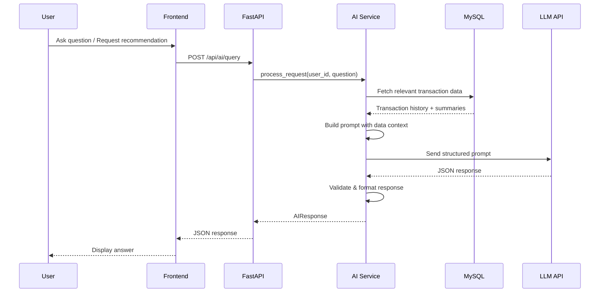

### Data Sent to LLM

The AI service assembles a data context tailored to the request type:

| Request Type | Data Included |
|--------------|---------------|
| Budget Recommendation | Last 30-90 days of transactions aggregated by category; total income; existing budgets; category averages |
| Proactive Coaching | Current budget status; pro-rated expected vs actual; previous period patterns; deviation percentage |
| Data Query | Relevant transactions for the time range mentioned (max 500 records summarized); category totals; running totals |

**Data minimization**: Raw transaction notes are NOT sent to the LLM. Only aggregated amounts, category names, dates, and computed statistics are included.

### Prompt Structure

```python
SYSTEM_PROMPT = """You are a personal budget coach. You help users understand 
their spending patterns and make better financial decisions.

Rules:
- Always reference specific numbers from the user's data
- Never invent data that isn't provided in the context
- Format monetary amounts with the user's currency symbol: {currency_symbol}
- Keep responses concise (under 200 words for queries, under 300 for recommendations)
- If data is insufficient, say so clearly and state what's needed
- Respond in plain language, avoid jargon
"""

def build_recommendation_prompt(user_data: UserFinancialContext) -> str:
    return f"""Based on the following financial data, provide budget recommendations:

Income (last 30 days): {user_data.total_income}
Spending by category (last 30 days):
{format_category_breakdown(user_data.category_totals)}

Existing budgets: {format_existing_budgets(user_data.budgets)}
Days of history available: {user_data.days_of_history}

Provide a recommended monthly budget for each category with at least 3 transactions.
Explain your reasoning for each recommendation."""

def build_query_prompt(user_data: UserFinancialContext, question: str) -> str:
    return f"""Answer this question about the user's finances: "{question}"

Available data:
- Date range: {user_data.earliest_date} to {user_data.latest_date}
- Transactions summary:
{format_query_context(user_data)}

Provide a specific answer with numbers and the time range analyzed.
If the data is insufficient to answer, explain what's missing."""
```

### Response Handling

- LLM responses are parsed for structured content (amounts, category names)
- Amounts in LLM responses are validated against actual data (hallucination guard)
- Responses exceeding timeout (15s for recommendations, 10s for queries) are aborted
- Failed requests return a standard "assistant unavailable" message

## PWA Considerations

### Service Worker Strategy

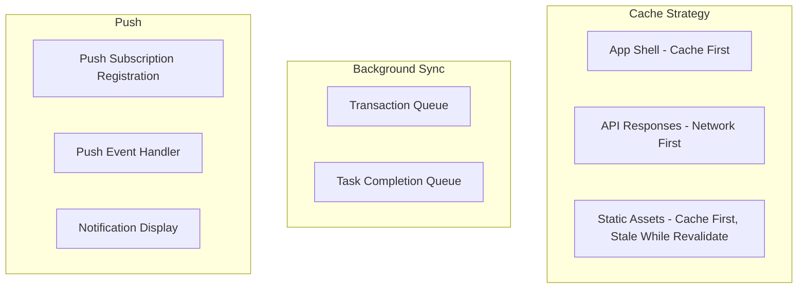

**Caching tiers:**
1. **App Shell** (HTML, JS, CSS): Precached on install; updated on new service worker version
2. **Locale configs**: Cached on first load; rarely changes
3. **Recent transactions**: Cached with network-first strategy; stale data acceptable for display
4. **Budget status**: Network-first with 5-minute cache fallback

### Offline Transaction Logging

When the user logs a transaction offline:
1. Transaction is saved to IndexedDB with a `pending_sync` flag
2. UI shows "saved offline" indicator with checkmark
3. When connectivity returns, Background Sync API triggers upload
4. On successful sync, `pending_sync` flag is cleared
5. If sync fails, retry on next connectivity event (up to 24 hours, then prompt user)

### Push Notifications

```javascript
// Service worker push event handler
self.addEventListener('push', (event) => {
  const data = event.data.json();
  // Types: daily_reminder, budget_80, budget_100, spike_alert, 
  //        summary_ready, ai_coaching
  const options = {
    body: data.body,
    icon: '/icons/money-tracker-192.png',
    badge: '/icons/badge-72.png',
    tag: data.type, // Prevents duplicate notifications of same type
    data: { url: data.action_url }
  };
  event.waitUntil(self.registration.showNotification(data.title, options));
});
```

Push notifications are delivered via the Web Push Protocol (VAPID authentication). The backend stores push subscriptions per user and sends notifications through a push service (e.g., web-push library in Python).

### Installability

- Web App Manifest with name, icons (192px, 512px), theme color, start_url
- Meets Chrome installability criteria (service worker + manifest + HTTPS)
- Standalone display mode for app-like experience

## Locale/Currency Flow

The locale configuration flows through the system as follows:

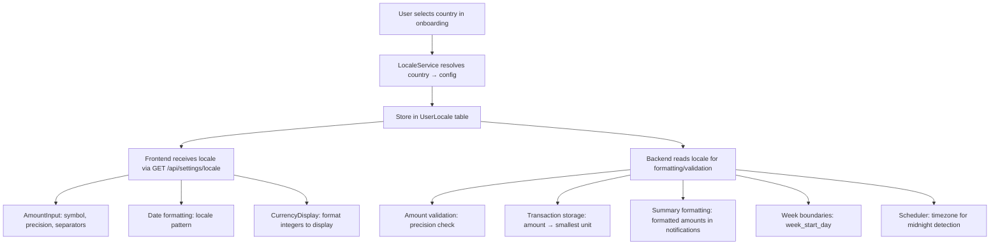

**Key principle**: The locale configuration is resolved once (on country selection or change) and stored. All components read from this stored configuration rather than re-resolving. Historical transactions carry their own `currency_code` so they remain correctly displayable even after a locale change.

## Profile & Weight Flow (Requirements 15–18)

The personalization flow extends the existing onboarding and connects profiles to budgets:

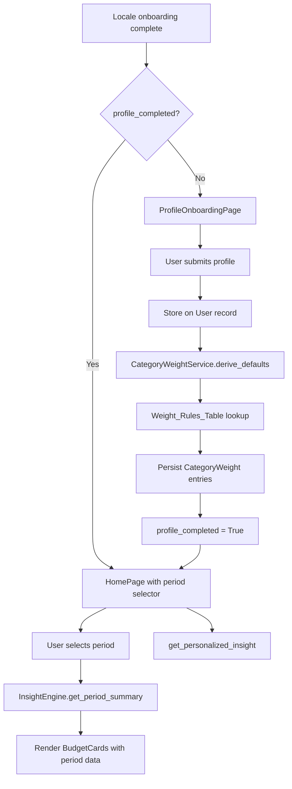

### Income → Budget Recalculation Flow

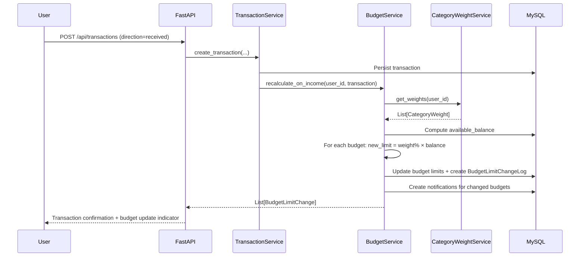

### Weight Override Flow

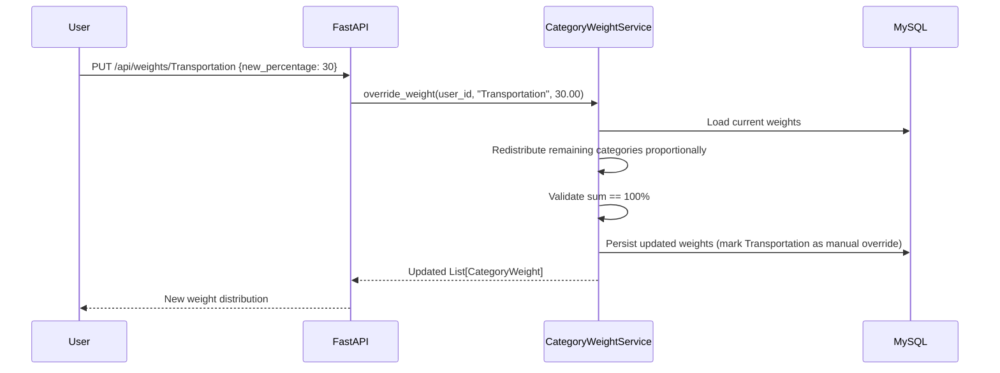
